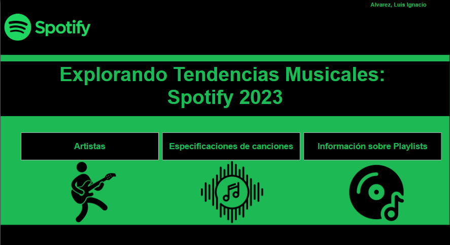
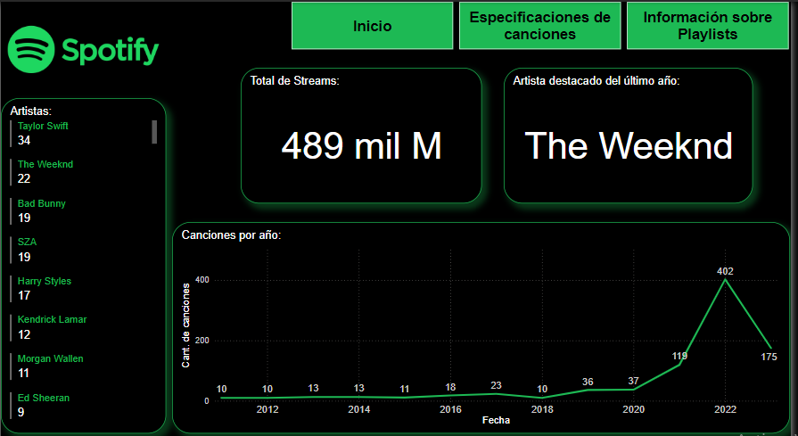
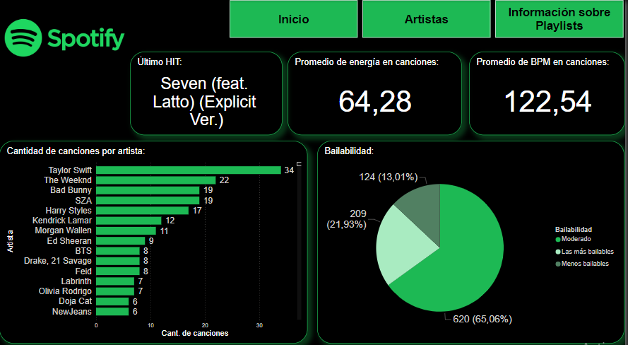
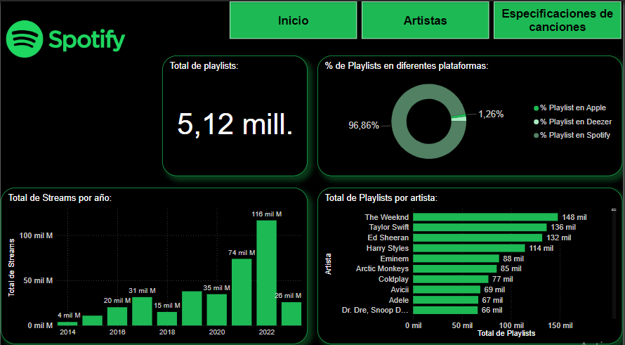

# Informe de Música Popular - Power BI Report

Este proyecto de Power BI permite explorar y analizar información sobre las canciones más populares, sus artistas y su desempeño en diversas plataformas de streaming. El informe está dividido en cuatro pestañas de análisis que detallan aspectos importantes como el total de streams, las características de las canciones y la distribución de playlists.

## Contenidos del Dashboard

### 1. Portada
Una introducción visual al informe, que incluye el título, una descripción general y un resumen de los contenidos.

### 2. Artistas
En esta pestaña se analiza el desempeño de los artistas en términos de sus canciones más populares y los streams acumulados.

- **Total de Streams por Artista:** KPI que muestra el total de streams acumulados por los artistas destacados.
- **Artista Destacado:** KPI que resalta al artista con mayor número de streams en el período analizado.
- **Gráfico de Líneas de Canciones por Artista:** Muestra la evolución de las canciones de cada artista a lo largo del tiempo.
- **Tarjeta de Varias Filas:** Muestra información clave sobre los artistas, como el nombre, la cantidad de canciones y los streams totales.

### 3. Especificaciones de Canciones
Esta pestaña proporciona un análisis detallado de las características de las canciones más populares.

- **Promedio BPM de Canciones:** KPI que muestra el promedio de BPM (Beats Per Minute) de las canciones.
- **Promedio de Energía de Canciones:** KPI que resalta el promedio de energía de las canciones.
- **Último HIT:** KPI que muestra el título de la canción más reciente con más streams.
- **Gráfico de Barras de Cantidad de Canciones por Artista:** Representa la cantidad de canciones por cada artista.
- **Bailabilidad en Gráfico de Tortas:** Divide las canciones en categorías de bailabilidad (bailable, moderado y poco).

### 4. Streams
Esta pestaña ofrece un análisis del total de streams y playlists por artista, así como la distribución de estos en diferentes plataformas.

- **Total de Streams por Año:** Gráfico de barras que muestra la cantidad total de streams anuales.
- **Total de Playlists por Artista:** Gráfico de barras que representa el número total de playlists en las que se encuentra cada artista.
- **Total de Playlists:** KPI que muestra el total acumulado de playlists en todas las plataformas analizadas.
- **% de Playlists en Diferentes Plataformas:** Gráfico que muestra la proporción de playlists en Spotify, Apple Music y Deezer.

## Tecnologías Utilizadas
- Power BI
- Datasets de streaming musical

